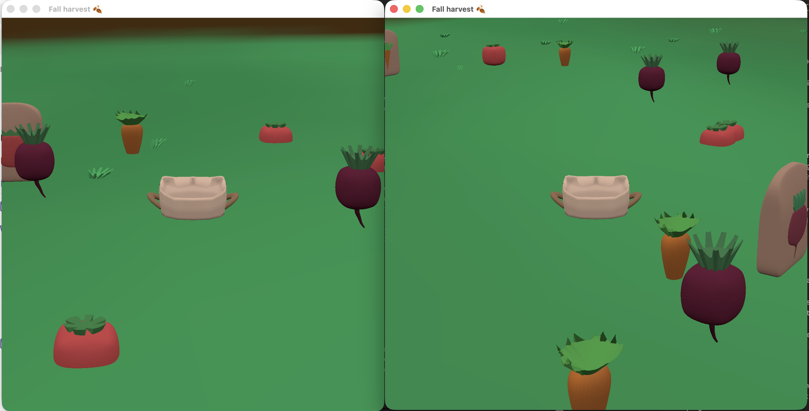

# Fall harvest

Author: Fara Yan

Design: You and your friends want to collect the fall harvest to make soup! Each of you has a garden with beets, carrots, tomatoes, and seeds to help each other grow more produce. Work together to harvest everything and win!

Networking: 
The clients each have their own garden and tell the server when they pick up vegetables and seeds. The server keeps the global counts and sends gifts or the win message to clients.

Message types:

- Pickup (client -> server): sent when a player picks up a vegetable or seed. The server updates totals or handles seed gifts in `server.cpp` when handling `Message::C2S_Pickup`.
- Gift (server -> client): when a seed packet is picked up, the server chooses a neighbor to send the `S2C_Gift` message to. If there's no other players, no gift message is sent and the single client receives their own gift. This is handled in `Message::S2C_Gift` in `server.cpp`.
- Win (server -> client): when clients collect enough veggies, the server broadcasts `S2C_Win` to all clients so they can switch to win mode.

Screen Shot:

How To Play:

- Use the A/D keys to rotate and W/S keys to move forward and backward.
- Collect carrots, tomatoes, and beets. You need a total of 12 carrots, 10 tomatoes, and 8 beets to make soup!
- When you collect a seed packet, it will be gifted to your neighbor's garden (the player who logged in immediately before/after you). They'll receive a gift box notification in the top left corner of their screen, and 3 new vegetables of that seed variety will appear in their garden.

Sources: n/a.

This game was built with [NEST](NEST.md).

